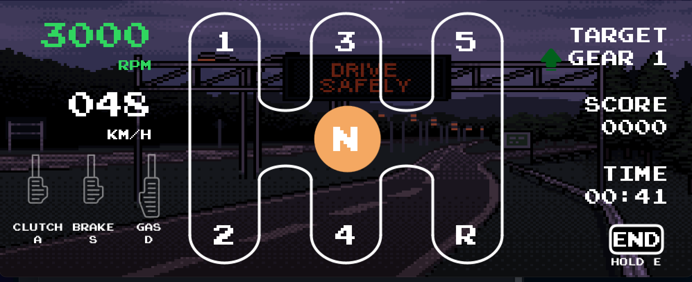
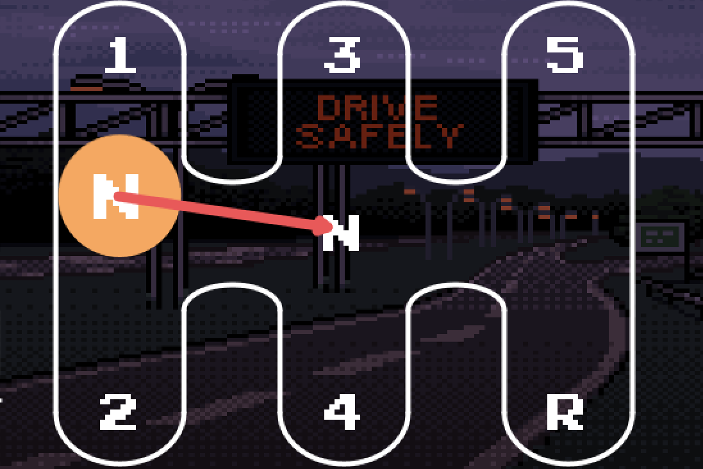

# Feel The Shift
An educational manual shifting simulator for Haply platform

Here is an image of the simulator in action:

The simulator creates an immersive experience for the user by providing haptic feedback through the Haply platform. The player shifts through the gears of a manual transmission interface and feels the forces caused during the gear changes. The simulator also provides a visual representation of the gear changes and the engine RPM. An example of the force is shown below in red:

## Getting Started
- Open Processing
- Go to sketch -> Import Library -> Add Library
- Install the Sound library
- Install the GifAnimation Library
- Ensure the Haply is connected to the correct port and the end effector is in the home (top) position 
- Open up and run FeelTheShift.pde
